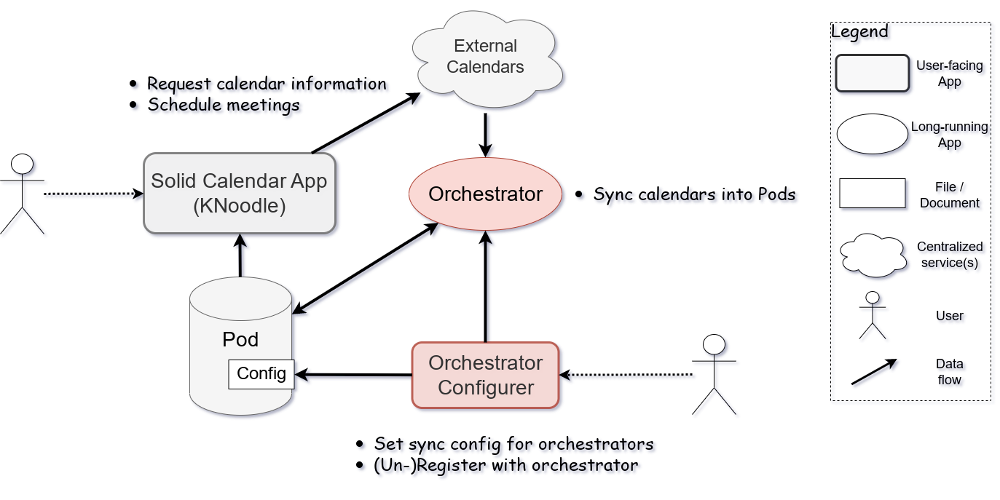

# Solid Calendar Orchestrator

This repo contains the core and configuration App for the Solid Calendar Orchestrator -- an application / service used to manage Solid Calendar, meant to be used together with [KNoodle](https://github.com/OxfordHCC/knoodle).

## Architecture

The `core` subdirectory corresponds to the *Orchestrator* component, as a long-running service.

The `app` subdirectory corresponds to the *Orchestrator Configurer* component, to configure users to a working orchestrator core service..

You'll probably also want to use [KNoodle](https://github.com/OxfordHCC/knoodle).

See also [this paper in TrusDeKW @ ESWC 22](https://ceur-ws.org/Vol-3443/ESWC_2023_TrusDeKW_paper_9130.pdf) for design justification.

## Getting started

1. Run the [core](core) on a server (see its README)
2. Run the [App](app) on anywhere (see its README)
3. Open the browser and navigate to App's webpage.

Refer to the relevant subdirectory for details.

### Notes on deployment location and usage

The core and App do not have to be deployed to the same machine. You can specify where the core is in the App.  
The core should be on a long-running server, so it can periodically update the calendar information to users' Pods.  
The App can be started only when needed, not necessarily deployed. 

## TODO

- [ ] Cleaner API
- [ ] Support advanced calendar source specification
     - [ ] multiple calendars
          - [x] core
          - [ ] app
     - [ ] transformations as in original [solid calendar store](https://github.com/KNowledgeOnWebScale/solid-calendar-store)
- [ ] Authenticate the user before performing actions for core